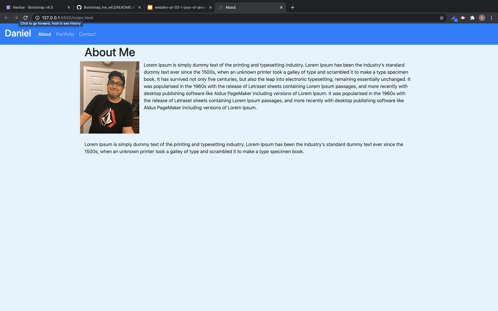
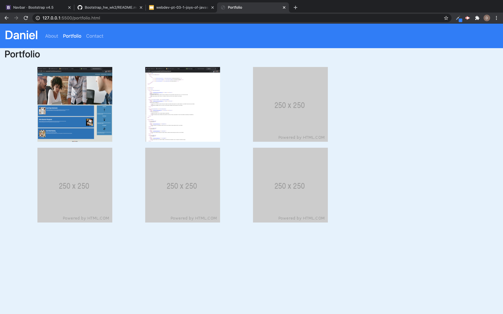
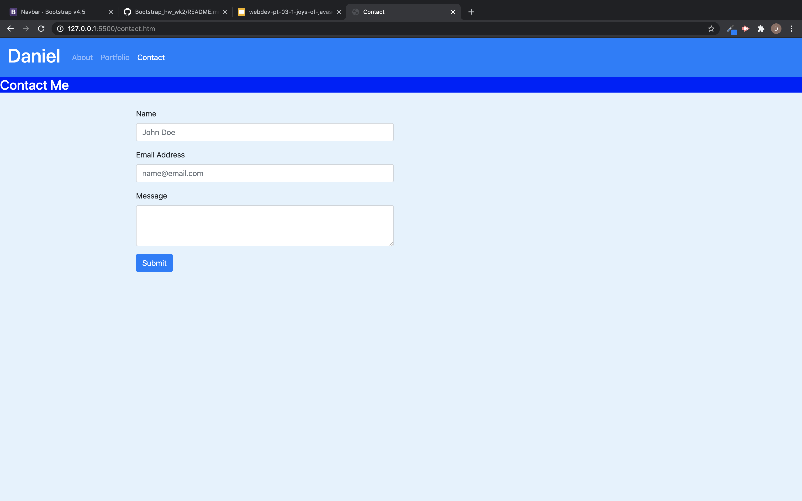

# Bootstrap_hw_wk2 

This is My portfolio site. 

In the index page you can find a picture of me and a short brief bio of me.
theres a navbar at the top that can cycle through other pages in my portfolio.(About,Portfolio,Contact)

In the portfolio page you can find screenshots of my past work that I have completed.
The nav bar up top should aslo be working in this page to direct you to the other pages within the portfolio.

The Contact page is the last page in my portfolio. You can find a form to contact me along with a short message.you can also find a working navbar to take you back home or any other page.

https://github.com/rendod99/Bootstrap_hw_wk2